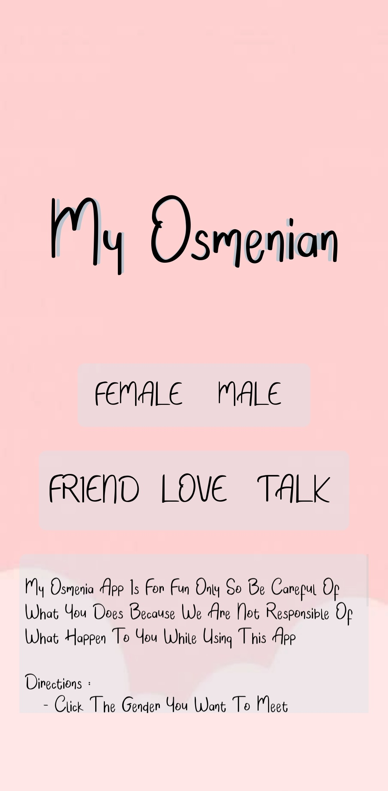
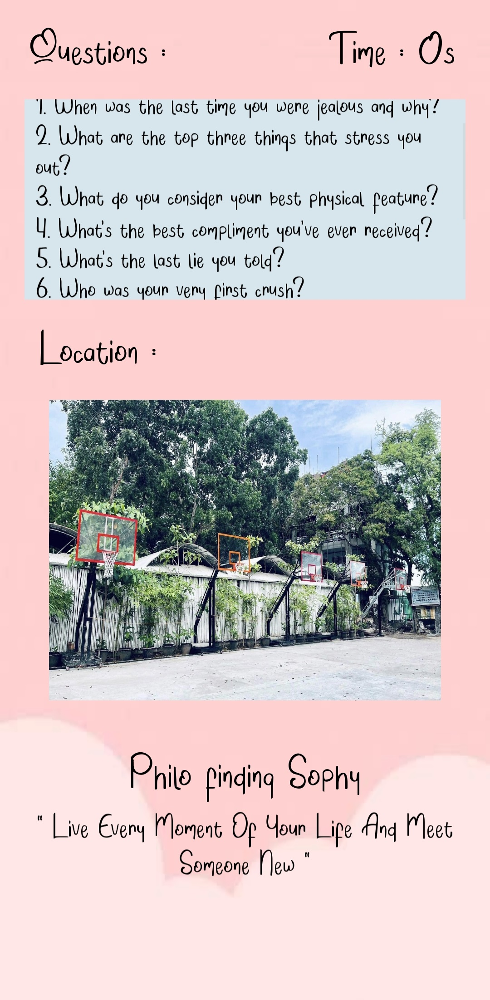
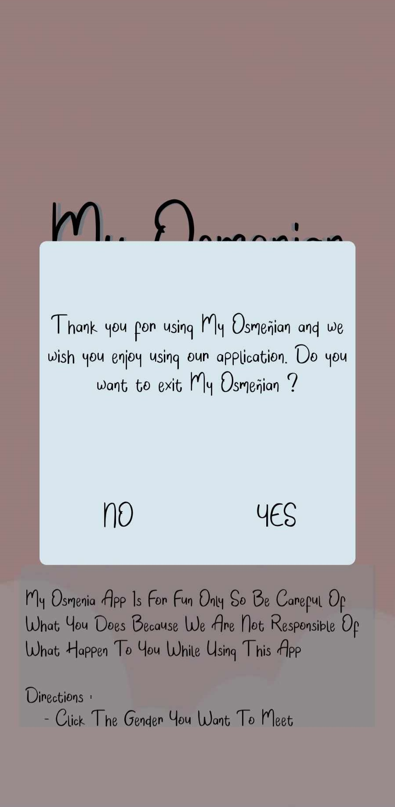

# MyOsmenian

## Description
MyOsmenian is a mobile application the use internet connection that connect user to find and meet each other.

## Usage
MyOsmenian is like a omegle but in the campus of Osmenia Colleges. It can be use to meet new friends or maybe a new love life and based on the type questions you selected you can start a topic based on it

## Images
### Main Screen of MyOsmenian

### App Content Preview

### Exit Preview

## Technology Stack
- **Programming Language:** Python
- **Framework:** Kivy and Kivymd

## Installation
For security reasons, OC TOUR is not available as a standalone Android or iOS app. However, it can be packaged into a mobile application using Buildozer.

## Acknowledgements
- Osmena Colleges
- Josh Ametin
- Jeremiah Aguilar
