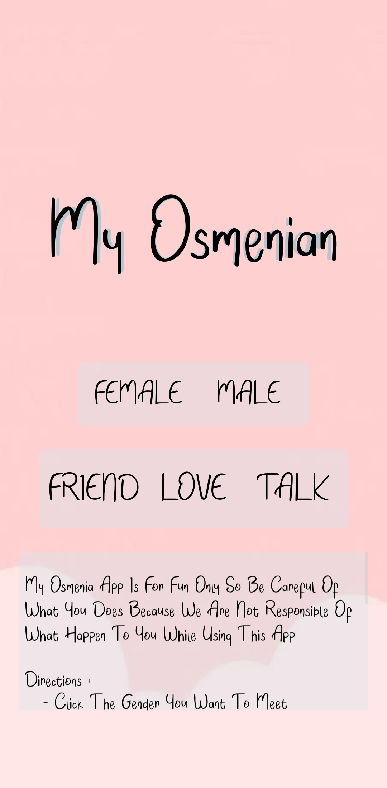
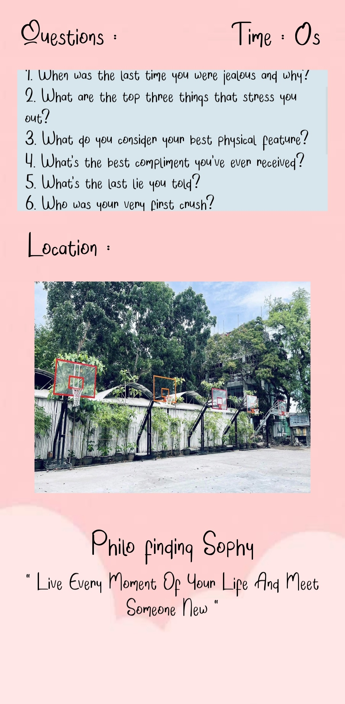
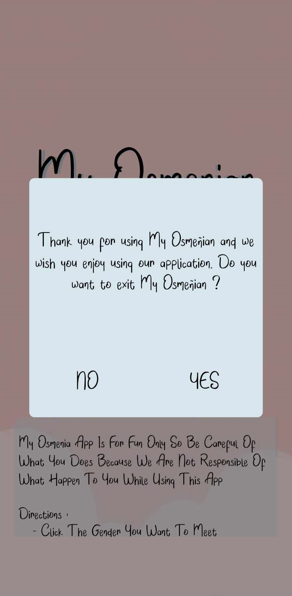

# MyOsmenian


---

# Short Introduction

**MyOsmenian** is a mobile application that enables students from Osmeña Colleges to connect with random people within their campus community through anonymous chat.

The platform allows users to select **conversation topics or question prompts**, which are then used to match them with another user who has similar interests. The goal is to encourage **social interaction, new friendships, and meaningful discussions within the campus environment**.

This project was developed as an exploration of **Python mobile development using Kivy**, as well as learning how to package Python applications into Android builds.

---

# System Description

MyOsmenian works as a **randomized campus chat matching system**.

Users select a set of conversation prompts or topics before entering the chat system. These prompts act as conversation starters and help reduce awkward first interactions.

Once inside the system:

1. The user selects conversation topics
2. The app searches for another user with similar selections
3. The system connects both users anonymously
4. Users can start chatting based on the selected prompts
5. Either user can leave and reconnect with another person

The goal of the system is to make **meeting new people easier while keeping the experience casual and low pressure**.

---

# Technologies Used

The project was built using the following technologies:

### Programming Language

* **Python**

### Mobile Development

* **Kivy** (Python framework for cross-platform apps)

### Android Packaging

* **Python-for-Android**
* **Buildozer**

### iOS Experimentation

* **Kivy-iOS**

### Development Environment

* **Linux**
* **Google Colab**

### Other Tools

* Git
* GitHub

---

# Process: How I Built It

### 1. Idea and Concept

The project started with the idea of creating a **campus-specific social chat platform** similar to Omegle but limited to a school community.

### 2. UI Development

Using **Kivy**, I created the graphical interface including:

* Topic selection screen
* Chat interface
* Connection/matching UI

### 3. Matching Logic

Basic logic was implemented to:

* Allow users to choose conversation prompts
* Use those prompts as starting topics for chats

### 4. Mobile Packaging

The Python application was compiled into an **Android APK** using:

* Python-for-Android
* Buildozer

### 5. Testing

The application was tested on Android devices to ensure the UI and chat flow worked correctly.

---

# What I Learned

Working on this project helped me learn several technical and practical skills:

* Building **mobile apps using Python**
* Designing **user interfaces using Kivy**
* Packaging Python apps into Android APK files
* Understanding **cross-platform mobile development**
* Debugging issues related to mobile builds
* Managing development in a **Linux environment**

I also improved my ability to **structure a software project from idea to working prototype**.

---

# Overall Growth

This project significantly improved my confidence in building complete software systems.

Before creating MyOsmenian, I mainly worked on smaller Python scripts. Through this project I learned how to:

* Design a full application workflow
* Work with mobile frameworks
* Solve packaging and environment issues
* Think about user experience

It helped me transition from **writing scripts to building applications**.

---

# How This Project Can Be Improved

There are several ways the system could be improved in the future:

* Add **real-time backend servers** for better matchmaking
* Implement **user authentication**
* Improve **UI/UX design**
* Add **moderation and reporting tools**
* Implement **topic-based intelligent matching**
* Add **push notifications**
* Improve scalability using a backend like:

  * Firebase
  * WebSockets
  * FastAPI

These improvements would make the platform more reliable and production-ready.

---

# Running the Project

### Requirements

* Python 3.x
* Kivy
* Linux environment (recommended)
* Buildozer
* Python-for-Android

### Clone the Repository

```bash
git clone https://github.com/astigPree/MyOsmenian.git
cd MyOsmenian
```

### Install Dependencies

```bash
pip install kivy
```

### Run the Application

```bash
python main.py
```

### Build Android APK (Optional)

```bash
buildozer android debug
```

---

# App Images
# Main Screen of MyOsmenian

# App Content Preview

# Exit Preview


 
